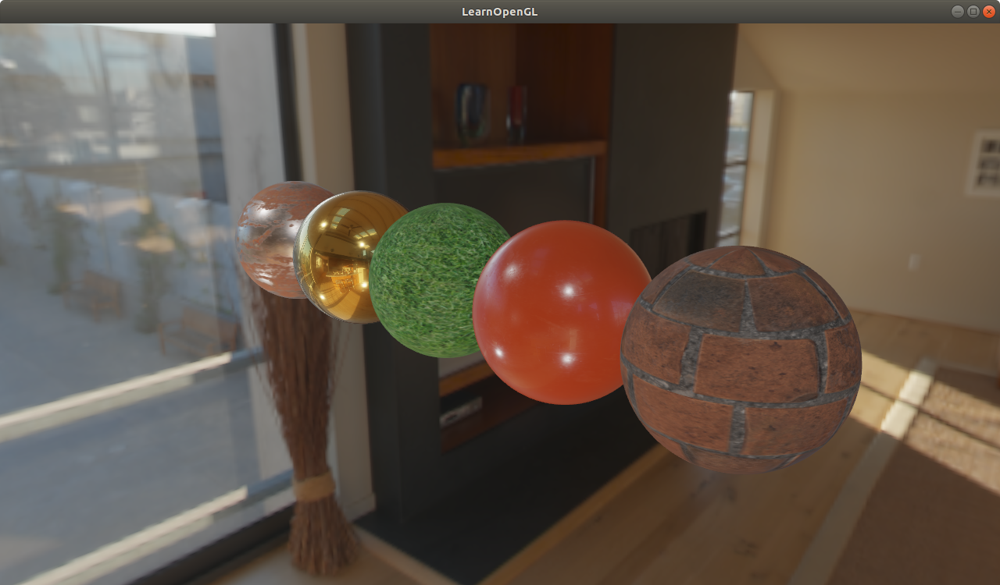

# 0. 编译示例源代码

README里直接有了，只记录卡住的部分。

## Linux building
First make sure you have CMake, Git, and GCC by typing as root (sudo) `apt-get install g++ cmake git` and then get the required packages:
Using root (sudo) and type `apt-get install libsoil-dev libglm-dev libassimp-dev libglew-dev libglfw3-dev libxinerama-dev libxcursor-dev  libxi-dev` .
Next, run CMake (preferably CMake-gui). The source directory is LearnOpenGL and specify the build directory as LearnOpenGL/build. Creating the build directory within LearnOpenGL is important for linking to the resource files (it also will be ignored by Git). Hit configure and specify your compiler files (Unix Makefiles are recommended), resolve any missing directories or libraries, and then hit generate. Navigate to the build directory (`cd LearnOpenGL/build`) and type `make` in the terminal. This should generate the executables in the respective chapter folders.

Note that CodeBlocks or other IDEs may have issues running the programs due to problems finding the shader and resource files, however it should still be able to generate the exectuables. To work around this problem it is possible to set an environment variable to tell the tutorials where the resource files can be found. The environment variable is named LOGL_ROOT_PATH and may be set to the path to the root of the LearnOpenGL directory tree. For example:

    `export LOGL_ROOT_PATH=/home/user/tutorials/LearnOpenGL`

Running `ls $LOGL_ROOT_PATH` should list, among other things, this README file and the resources direcory.

没遇到什么问题，基本操作步骤:

```
cd LearnOpenGL
sudo su
apt-get install g++ cmake git
apt-get install libsoil-dev libglm-dev libassimp-dev libglew-dev libglfw3-dev libxinerama-dev libxcursor-dev  libxi-dev
mkdir build
cd build
cmake ..
make -j 14
```

运行其中一个样例，看看效果
```
cd bin/6.pbr
./6.pbr__2.2.2.ibl_specular_textured
```

运行效果:



