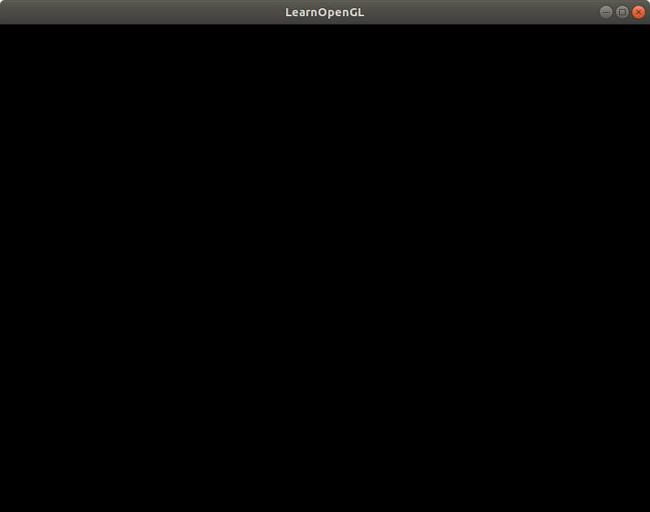

# 窗口的创建 

链接:
[https://learnopengl-cn.github.io/01%20Getting%20started/03%20Hello%20Window/](https://learnopengl-cn.github.io/01%20Getting%20started/03%20Hello%20Window/)

最先能初始化一个窗口的代码长这样：

```cpp
#include <glad/glad.h>
#include <GLFW/glfw3.h>
#include <iostream>
#include <stdio.h>

void framebuffer_size_callback(GLFWwindow* window, int width, int height);

void framebuffer_size_callback(GLFWwindow* window, int width, int height)
{
	glViewport(0, 0, width, height);
}

int main()
{
	glfwInit();
	glfwWindowHint(GLFW_CONTEXT_VERSION_MAJOR, 3);
	glfwWindowHint(GLFW_CONTEXT_VERSION_MINOR, 3);
	glfwWindowHint(GLFW_OPENGL_PROFILE, GLFW_OPENGL_CORE_PROFILE);
	//glfwWindowHint(GLFW_OPENGL_FORWARD_COMPAT, GL_TRUE);

	GLFWwindow* window = glfwCreateWindow(800, 600, "LearnOpenGL", NULL, NULL);
	if (window == NULL)
	{
		std::cout << "Failed to create GLFW window" << std::endl;
		glfwTerminate();
		return -1;
	}

	glfwMakeContextCurrent(window);

	if (!gladLoadGLLoader((GLADloadproc)glfwGetProcAddress))
	{
		std::cout << "Failed to initialize GLAD" << std::endl;
		return -1;
	}


	glfwSetFramebufferSizeCallback(window, framebuffer_size_callback);

	while(!glfwWindowShouldClose(window))
	{
		glfwSwapBuffers(window);
		glfwPollEvents();    
	}


	glfwTerminate();
	return 0;
}
```

还是一个经典的，准备，然后进入事件循环的过程。

`glfwSetFramebufferSizeCallback` 这个回调函数是在glfw检测到窗口大小被拖动改变时调用的, 回调的内容:

```cpp
glViewport(0, 0, width, height);
```

会把OpenGL的渲染区域设置为整个glfw的窗口里，是的，可以通过改变这里的参数，只在窗口的一部分区域渲染OpenGL。

我对代码的实验是通过改写示例代码进行的，这样就不用关心编译参数的事情了，编译测试的命令如下：

```bash
LearnOpenGL/build$ make -j; pushd . ; cd bin/1.getting_started/ ; ./1.getting_started__1.1.hello_window ; popd
```

代码运行的结果很简单，就是一个全黑的窗口，因为我们还没有开始绘制任何东西进去。




